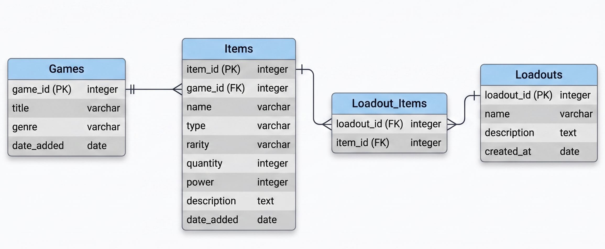

# Entity Relationship Diagram

Reference the Creating an Entity Relationship Diagram final project guide in the course portal for more information about how to complete this deliverable.

## Create the List of Tables

* **Games**: Game details.
* **Items**: Individual inventory objects linked to a specific game.
* **Loadouts**: User-created collections (builds) for grouping favorite items.
* **Loadout_Items**: To handle the many-to-many relationship between Loadouts and Items.

## Add the Entity Relationship Diagram

### 1. Games Table
Stores the library data seen in the "Game Library" page.

| Column Name | Type | Description |
|-------------|------|-------------|
| game_id | integer | primary key |
| title | varchar | name of the game (e.g., "Elden Ring") |
| genre | varchar | genre of the game (e.g., "Action RPG") |
| date_added | date | the date the game was added to the library |

### 2. Items Table
Stores the details for every piece of gear, material, or consumable within a game's inventory.

| Column Name | Type | Description |
|-------------|------|-------------|
| item_id | integer | primary key |
| game_id | integer | foreign key linking the item to a specific game |
| name | varchar | name of the item (e.g., "Moonveil Katana") |
| type | varchar | category (e.g., "Weapon", "Armor", "Material") |
| rarity | varchar | rarity tier (e.g., "Common", "Rare", "Legendary") |
| quantity | integer | the number of items currently held |
| power | integer | the numerical power or stat value |
| description | text | flavor text or description of the item |
| date_added | date | the date the item was created in the system |

### 3. Loadouts Table
Stores the metadata for custom collections (builds).

| Column Name | Type | Description |
|-------------|------|-------------|
| loadout_id | integer | primary key |
| name | varchar | name of the build (e.g., "Magic Knight Build") |
| description | text | user-defined summary of the loadout's purpose |
| created_at | date | timestamp of when the loadout was created |

### 4. Loadout_Items Table
Since one loadout contains many items, and one item could be part of multiple loadouts, this table connects them.

| Column Name | Type | Description |
|-------------|------|-------------|
| loadout_id | integer | foreign key linking to the Loadouts table |
| item_id | integer | foreign key linking to the Items table |