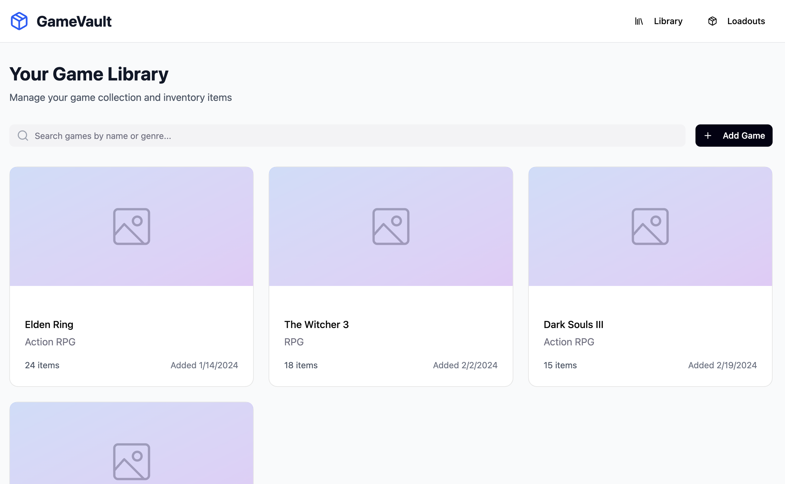
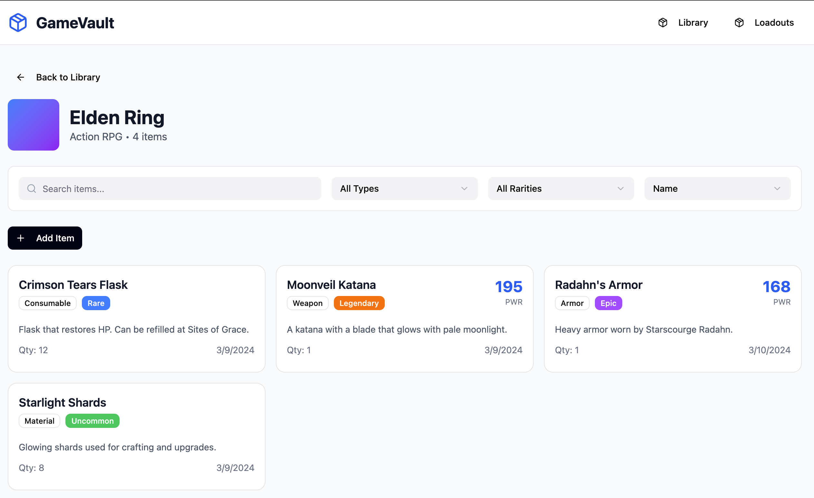
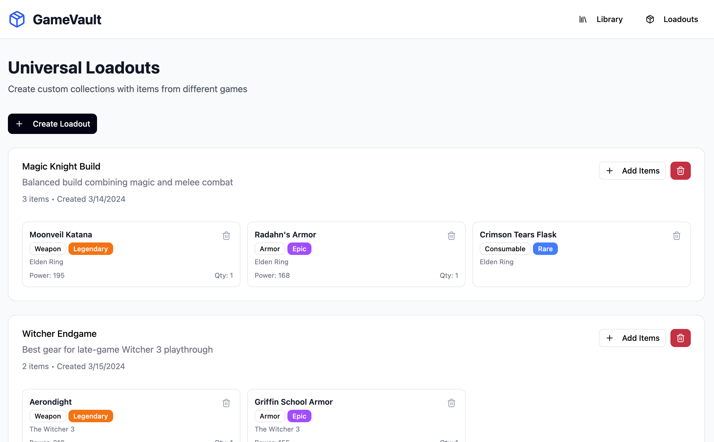
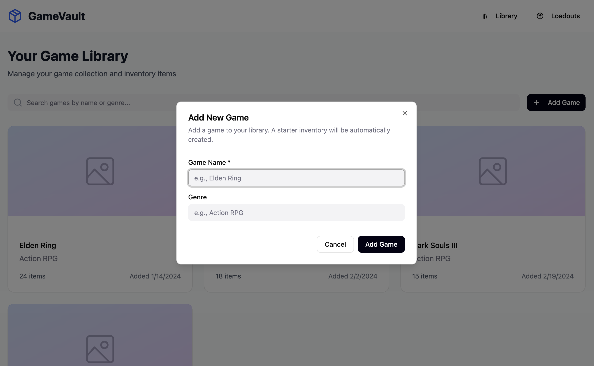
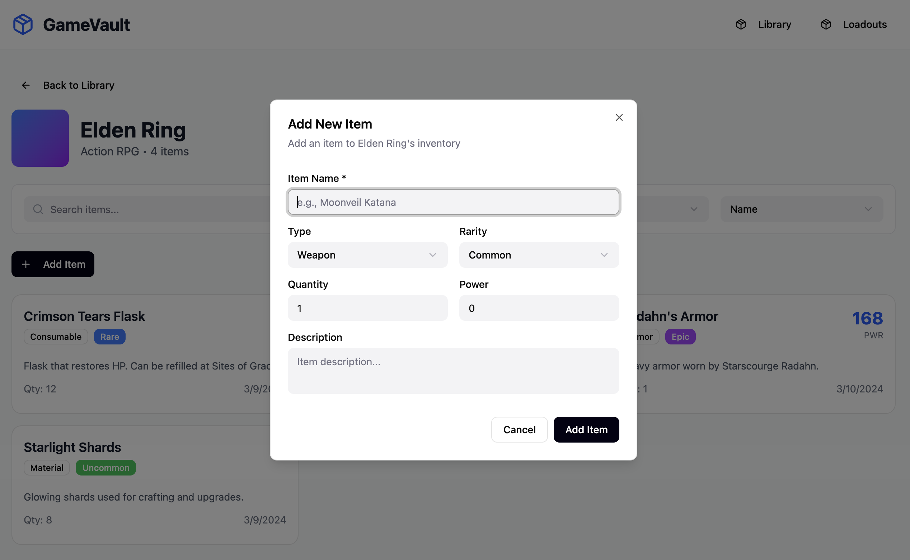
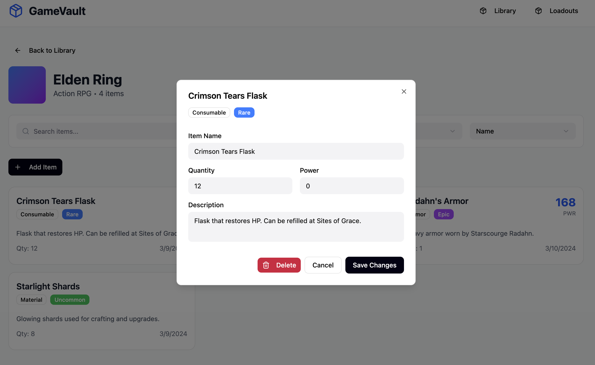
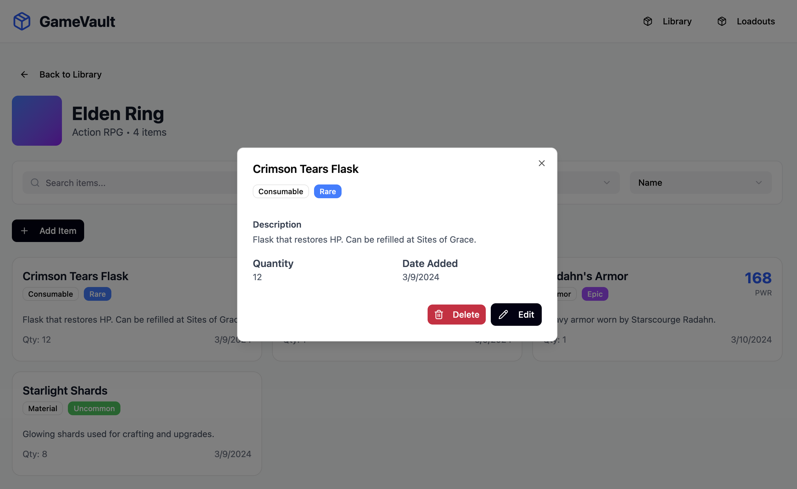
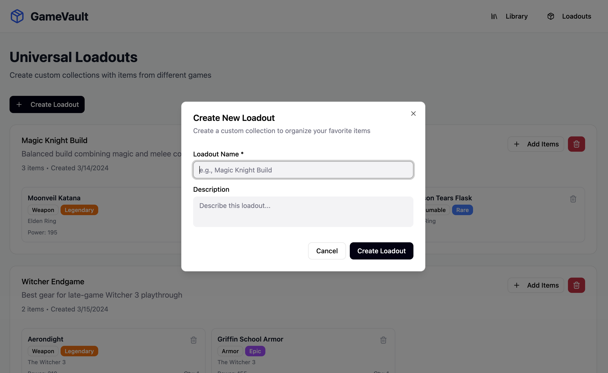

# Wireframes

Reference the Creating an Entity Relationship Diagram final project guide in the course portal for more information about how to complete this deliverable.

## List of Pages

⭐ Game library page
⭐ Item management page (per game)
⭐ Universal loadout page
⭐ Modals:
  * Add game
  * Add item
  * Edit item
  * View/Manage item
  * Add loadout

## Wireframe 1: Game library page

## Wireframe 2: Item management page

## Wireframe 3: Universal loadout page

## Modals
### Add game

### Add item

### Edit item

### View/Manage item

### Add loadout

